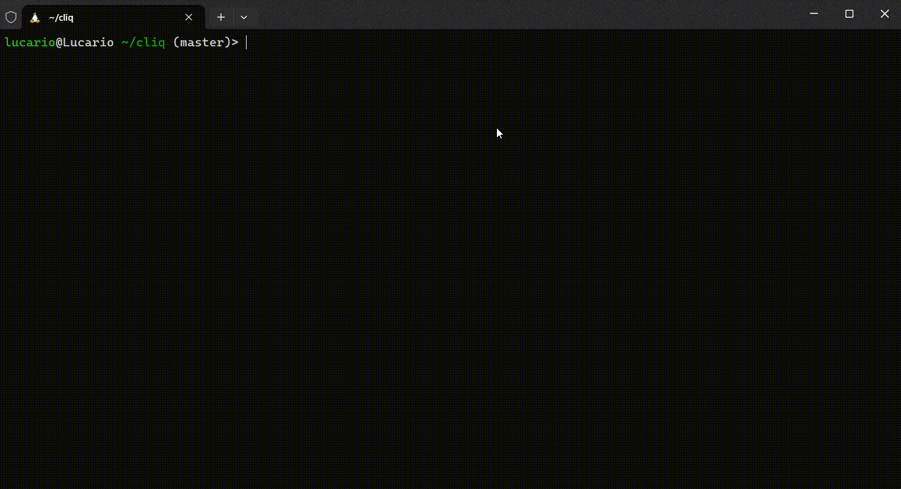

# cliz

🤖 Hello human, my name is cliz (cli + z), A useful command-line agent help you work with your favorite tools!

## Table of Contents

- [Features](#features)
- [Examples](#examples)
- [Install](#install)
- [Roadmap](#roadmap)

## Features

- 🚀 Lightweight & Fast: cliz is just `10M+` and run extremely fast.
- 🌟 CLI Agent: cliz is a `command-line agent`, help you work with your favorite cli tools!
- 📚 Chat History: cliz can remember chat history, and continue the conversation.
- 🛡️ Secure: all tool-call requests need to be approved by user, We also has `auto` mode.

Enjoy your cliz!

## Examples

Help me download video `https://www.bilibili.com/video/BV1GJ411x7h7` to local folder `videos/`.


Fetch deepseek-v3 github homepage, and save to deepseek-v3.md.



## Install

Step 1: install from pip:

```bash
pip install cliz
```

Step 2: make config file:

```bash
mkdir -p ~/.cliz
vim ~/.cliz/cliz.yaml
```

This is a template yaml, write your LLMs provider, and add any tools you like. This is my [config](cliz.yaml):

```yaml
auto: false # disable auto mode
chat_history: true # enable chat history
respond_language: "English" # you can switch language to "中文"
llm: # set your favorite LLMs
  base_url: "xxx"
  api_key: "xxx"
  model: "xxx"
tools: # add more tools you like!
  - name: "zstd"
    description: "Zstandard - Fast real-time compression algorithm"
  - name: "rsync"
    description: "Rsync is a fast and extraordinarily versatile file copying tool for both remote and local file"
  - name: "uv"
    description: "An extremely fast Python package and project manager, written in Rust"
  - name: "yt-dlp"
    description: "A feature-rich command-line audio/video downloader"
```

Step 3: Run cliz!

```bash
cliz "build a operation system for me. :D"
```

Also run `auto` mode with `--auto` or set `auto: true` in config file:

```bash
cliz --auto "build a operation system for me. :D"
```

## Roadmap

- [ ] Add agent memory
- [ ] Release to homebrew
